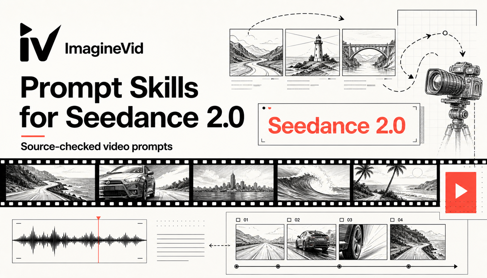

<a href="https://github.com/imagineVid/Awesome-seedance-2-0-prompts-and-skills"></a>

# Awesome Seedance 2.0 Prompts & Skills

> مطالبات مجتمعية موثقة المصدر مع ملاحظات إنتاج قابلة لإعادة الاستخدام ووسائط أصلية ونَسب واضح للمبدعين.

[](https://github.com/sindresorhus/awesome) [](LICENSE) [](https://github.com/imagineVid/Awesome-seedance-2-0-prompts-and-skills)

[English](README.md) · [简体中文](README.zh.md) · [日本語](README.ja.md) · [한국어](README.ko.md) · [Español](README.es.md) · [Deutsch](README.de.md) · [Français](README.fr.md) · [Italiano](README.it.md) · [Português](README.pt.md) · [Türkçe](README.tr.md) · [**العربية**](README.ar.md) · [Русский](README.ru.md) · [Nederlands](README.nl.md) · [Polski](README.pl.md)

---

## المحتويات

- [دليل النموذج](#model-guide)
- [فهرس سير العمل](#workflow-index)
- [حالات مجتمعية موثقة](#verified-community-cases)
- [المساهمة](#contribute)
- [الترخيص والنَسب](#license-and-attribution)

<a id="model-guide"></a>

## دليل النموذج

Seedance 2.0 نموذج مخصص لـإنشاء الفيديو متعدد الوسائط والتحرير والإنتاج الموجّه بالمراجع. يتجنب المستودع الادعاءات الترويجية غير القابلة للتحقق، ويستخلص أساليب قابلة لإعادة الاستخدام من حالات تتضمن المطالبة الكاملة والنتيجة والمصدر الأصلي.

### ما الذي تختبره المجموعة

- Multimodal reference direction across image, video, and audio inputs
- Joint visual and audio timing for dialogue, Foley, ambience, and music
- Long-take camera paths, character performance, and scene continuity
- Natural-language editing and controlled transformation of existing footage

**[Open Seedance 2.0 on ImagineVid](https://imaginevid.io/seedance-2-0)**

<a id="workflow-index"></a>

## فهرس سير العمل

- **Multimodal Reference Direction**
- **Long-Take Camera Choreography**
- **Narrative Action & Performance**
- **Commercial Storyboards**
- **Worldbuilding & Environmental Motion**

<a id="verified-community-cases"></a>

## حالات مجتمعية موثقة

| حالة المجموعة | 5 حالات موثقة |
|---|---:|
| آخر إنشاء | 2026-07-18 |

### 1. Crimson roots erupt across a barren fashion landscape

A surreal fashion sequence that connects costume, landscape, and large-scale environmental growth.

#### المطالبة

```text
A cinematic, high-fashion close-up and medium shot of an elegant East Asian woman wearing a striking white and red abstract-patterned cloak with a high, ruffled collar, standing in a barren, desolate landscape under a dim, overcast sky. She interacts with a massive, ancient tree with dark, gnarled bark and deep crimson, leaf-covered branches. The ground is dry and cracked, and suddenly, thick, vein-like crimson roots or tendrils erupt from the earth, surrounding her and growing upward towards the sky in a dramatic, surreal sequence
```

<div align="center"><a href="https://video.twimg.com/amplify_video/2078353150441054209/vid/avc1/1276x718/9kWYr_OUI_RlxLLl.mp4?tag=29"></a>

**[▶ شاهد الفيديو الأصلي](https://video.twimg.com/amplify_video/2078353150441054209/vid/avc1/1276x718/9kWYr_OUI_RlxLLl.mp4?tag=29)**</div>

#### دليل المصدر

- **المبدع:** [@AvelyrahnAI](https://x.com/AvelyrahnAI)
- **المنشور الأصلي:** [X / Twitter](https://x.com/AvelyrahnAI/status/2078353296654557318)
- **تاريخ النشر:** 2026-07-18
- **Category:** Multimodal Reference Direction

**[استخدم المطالبة على ImagineVid](https://imaginevid.io/seedance-2-0)**

---

### 2. Fifteen-second spiced biscuit commercial

A compact product brief organized into timed shots, sensory close-ups, and a clear payoff.

#### المطالبة

```text
(15 sec Ad Video – Zeera Biscuits)
Scene 1 (0–3s):

Close-up shot of crispy golden Zeera biscuits placed on a wooden table. Light steam tea cup beside it. Soft morning sunlight.
👉 Text on screen: “Subah ki perfect shuruaat…”

Scene 2 (3–6s):
Slow-motion biscuit break — crunch sound — zeera (cumin seeds) visible inside. Crumbs falling in cinematic style.
👉 Sound: Satisfying crispy crunch

Scene 3 (6–10s):
Young person dipping biscuit into chai ☕, smiling. Cozy home vibe.
👉 Text: “Har bite mein asli taste”

Scene 4 (10–13s):
Pack shot of Zeera Biscuits rotating with glowing light effect.
👉 Text: “Crispy • Tasty • Classic”

Scene 5 (13–15s):
Final frame: Family enjoying tea with biscuits together ❤️
👉 Text: “Zeera Biscuits – Har chai ka best partner”
```

<div align="center"><a href="https://video.twimg.com/ext_tw_video/2078345208803258368/pu/vid/avc1/1280x720/-LOyxmTpQc6-aoSy.mp4?tag=27"></a>

**[▶ شاهد الفيديو الأصلي](https://video.twimg.com/ext_tw_video/2078345208803258368/pu/vid/avc1/1280x720/-LOyxmTpQc6-aoSy.mp4?tag=27)**</div>

#### دليل المصدر

- **المبدع:** [@Itswsm105f](https://x.com/Itswsm105f)
- **المنشور الأصلي:** [X / Twitter](https://x.com/Itswsm105f/status/2078345254541967498)
- **تاريخ النشر:** 2026-07-18
- **Category:** Long-Take Camera Choreography

**[استخدم المطالبة على ImagineVid](https://imaginevid.io/seedance-2-0)**

---

### 3. Cyberpunk speed-versus-strength duel

A readable action setup that contrasts two fighting styles through camera rhythm and visible impacts.

#### المطالبة

```text
Cinematic 3D animation, futuristic cyberpunk city at night with neon billboards reflecting on wet asphalt. A sleek, agile female cyborg character wearing a black high-tech bodysuit and glowing purple rollerblades skates at high speed towards a massive, hulking mutated monster standing in her path. The character performs a graceful, high-speed jump, swirling through the air surrounded by glowing purple energy trails, then lands a powerful strike against the monster. Dynamic camera angles, motion blur, hyper-realistic textures, intense action atmosphere, 8k resolution.
```

<div align="center"><a href="https://video.twimg.com/amplify_video/2078327923296411648/vid/avc1/720x1280/XIprbDZ5CgjcG5pI.mp4?tag=29"></a>

**[▶ شاهد الفيديو الأصلي](https://video.twimg.com/amplify_video/2078327923296411648/vid/avc1/720x1280/XIprbDZ5CgjcG5pI.mp4?tag=29)**</div>

#### دليل المصدر

- **المبدع:** [@AvelyrahnAI](https://x.com/AvelyrahnAI)
- **المنشور الأصلي:** [X / Twitter](https://x.com/AvelyrahnAI/status/2078327970012500268)
- **تاريخ النشر:** 2026-07-18
- **Category:** Narrative Action & Performance

**[استخدم المطالبة على ImagineVid](https://imaginevid.io/seedance-2-0)**

---

### 4. Lighthouse survival sequence in a hurricane

A dense weather-and-stunt brief that coordinates waves, debris, rescue action, and camera placement.

#### المطالبة

```text
New prompt drop - The lighthouse - 
seedance 2.0 on @Hailuo_AI 

Hyper-realistic cinematic action sequence, 15 seconds, aspect ratio 16:9.  Night. 

On a remote rocky coast during a violent hurricane, a lighthouse keeper climbs the outside of a tall lighthouse to reach the emergency beacon at the top. The storm is brutal and the situation is urgent. Heavy rain lashes the tower, hurricane-force wind pushes hard against the keeper, and giant waves crash violently into the rocks and the base of the lighthouse. 

The exterior is simple and clear: wet stone walls, narrow metal ladder sections, exposed railings, a small exterior platform near the top, and the dark emergency beacon housing above.  

Wide opening shot: the lighthouse keeper steps out onto the exterior of the lighthouse in the middle of the hurricane and immediately begins climbing upward. Rain blasts sideways, wind whips clothing, and huge waves explode against the base of the tower below.  

Tracking shot: the keeper climbs higher along the outside ladder and narrow metal steps while the storm intensifies. The tower shakes from the force of the sea. Lightning flashes across the sky. The keeper nearly loses grip once, slams against the wall, recovers, and keeps climbing. The beacon above is dark, making the danger feel more urgent.  

Side shot: the keeper reaches the upper exterior section near the beacon platform. A massive gust hits hard. The keeper clings to the ladder, almost gets pulled away, then forces upward again. Water pours down the stone, the metal steps are slick, and another giant wave crashes into the lighthouse below, shaking the whole structure.  

Final 5 seconds: the action becomes extreme. The keeper pulls onto the tiny top platform while the hurricane is at full force. The platform rattles, the railing bends slightly under pressure, and the beacon housing swings or shakes in the wind. 

The keeper struggles across the platform, grabs the beacon assembly, and fights to secure or reconnect it while lightning flashes and spray blasts upward. At the last possible second, the beacon powers back on and cuts through the storm with a powerful beam.  Final moment: the lighthouse beacon shines through the hurricane while the keeper clings to the top platform, waves smashing below and rain whipping across the frame.  

Style: hyper-realistic, cinematic, fast-paced, intense, stressful, clear readable action, strong sense of height and danger, violent hurricane, heavy rain, powerful wind, crashing waves, shaking lighthouse, dynamic but readable camera movement, no text, no logos, no cartoon style, no slow motion, no famous celebrity faces, no recognizable actors, no movie-star resemblance, no public-figure likenesses, no clear facial close-ups. Keep proportions. Keep style and features. Aspect ratio 16:9.

Try it, change it, make it your own.
```

<div align="center"><a href="https://video.twimg.com/amplify_video/2078284413461221376/vid/avc1/864x496/W_nMJ1x-6M7Wwh_2.mp4?tag=29"></a>

**[▶ شاهد الفيديو الأصلي](https://video.twimg.com/amplify_video/2078284413461221376/vid/avc1/864x496/W_nMJ1x-6M7Wwh_2.mp4?tag=29)**</div>

#### دليل المصدر

- **المبدع:** [@DeCat2025](https://x.com/DeCat2025)
- **المنشور الأصلي:** [X / Twitter](https://x.com/DeCat2025/status/2078284800083857734)
- **تاريخ النشر:** 2026-07-18
- **Category:** Commercial Storyboards

**[استخدم المطالبة على ImagineVid](https://imaginevid.io/seedance-2-0)**

---

### 5. Orbital construction system collapse

A complex mechanical-disaster sequence built around synchronized motion, failure escalation, and spatial continuity.

#### المطالبة

```text
Prompt Studio: Orbital Collapse with Seedance 2.0 in @runwayml 

Colossal orbital construction system, synchronized assembly breaks down, turning massive moving parts into lethal, unpredictable motion.  
Wide shot: perfectly timed mechanical arms moving huge segments into place. 
Micro-delay: one segment arrives early, barely noticeable at first. 
Collision: misaligned parts slam together, throwing off timing across the system. 
Cascade: surrounding arms react too late, desynchronizing the entire structure. 
Hard dive: small ship enters the assembly zone as motion becomes chaotic. 
Near-crush: two massive plates slam shut just after the ship passes through. 
Timing gamble: pilot commits to a gap that’s already closing. 
Whip movement: a mechanical arm swings unpredictably across the path. 
Close scrape: ship rolls sideways, barely avoiding full impact. 
Moving maze: structure still assembling, but incorrectly, paths shifting constantly. 
Critical moment: a full segment drops into the escape vector. 
Last-second slip: ship squeezes through a narrowing gap as components collide behind.  
Rhythm collapse = danger, everything still moving with force but no coordination.
```

<div align="center"><a href="https://video.twimg.com/amplify_video/2078276937345056768/vid/avc1/3840x2160/lmG7-jOG-P9HJBvY.mp4?tag=29"></a>

**[▶ شاهد الفيديو الأصلي](https://video.twimg.com/amplify_video/2078276937345056768/vid/avc1/3840x2160/lmG7-jOG-P9HJBvY.mp4?tag=29)**</div>

#### دليل المصدر

- **المبدع:** [@AllaAisling](https://x.com/AllaAisling)
- **المنشور الأصلي:** [X / Twitter](https://x.com/AllaAisling/status/2078277108762038608)
- **تاريخ النشر:** 2026-07-18
- **Category:** Worldbuilding & Environmental Motion

**[استخدم المطالبة على ImagineVid](https://imaginevid.io/seedance-2-0)**

---

<a id="contribute"></a>

## المساهمة

أرسل فقط الحالات التي تذكر النموذج بوضوح وتوفر المطالبة الكاملة ونَسب المبدع ونتيجة قابلة للفحص.

[Submit a verified prompt](https://github.com/imagineVid/Awesome-seedance-2-0-prompts-and-skills/issues/new?template=submit-prompt.yml)

<a id="license-and-attribution"></a>

## الترخيص والنَسب

كود ImagineVid ونصه التحريري مرخصان وفق CC BY 4.0. وتبقى مطالبات ووسائط الأطراف الأخرى ملكاً لأصحابها.

The collection was curated by **Mira Voss** for ImagineVid.
